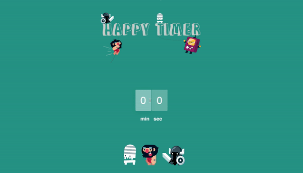

# **Happy Timer**
---
###### Welcome to [Happy Timer](https://happy-timer.herokuapp.com/)! Happy Timer is a simple count down application designed to deliver a unique user experience. Built entirely with React.js and CSS3, users are able to select a time and choose from one of three character animations. When the start button is clicked, the timer will begin its countdown and the selected animation will run alongside the clock.

###### Important Note: 


### Table of Contents
---

1. **Inspiration**
2. **Technologies**
3. **Code Snippets**
4. **Final Thoughts**


### Inspiration
---
###### Back when I was a student at App Academy, my teacher had us participate in a class hackathon. We were instructed to build a timer app within a three hour time frame and when the time was up, we were given the oppurtunity to share our projects with the rest of the class. However, instead of spending the hackathon building out my timer, I spent the entire time panicking because I had no idea how to go about building this app. After that day, I made it a point to go back and complete this project once I had graduated App Academy in order to prove to myself how much I had learned. 

###### My goal in making this app was to create something that represents who I am as a developer, a creative and most importantly, an individual. Coming from a unique background as a photographer and a musician, it was important for me to integrate my passion for creativity with my passion for code. What resulted from this was the idea to have animated characters run alongside the countdown timer. This was done by animating three different character models in Adobe After Effects and importing them into the React component.

### Technologies
---
- ##### React
    - ###### Since Happy Timer is a front-end project, I built the entire app with React in order to give the user a unique and fun user experience.
    - ###### I utilized class based components for the main timer functionality. Functional components are great,  but I wanted to gain familiarity with class based components in case I was ever exposed to older code bases.
- ##### CSS3
    - ###### Raw CSS was utilized to style the different components - no styling libraries or CSS frameworks were used in this project. This allowed me to have free reign over the user interface and let me customize the project to how I envisioned.
- ##### Adobe Creative Suite
    - ###### Adobe After Effects was used to animate the character models and the logo was designed in Adobe Illustrator.

### Code Snippets
---
##### Initial state
###### The initial state is comprised of the following and I will be referring back to this code snippet in my explanations:
``` JavaScript
this.state = {
            minutes: 0,
            minutes2: 0,
            seconds: 0,
            seconds2: 0,
            running: false,
            skeletonAnimation: false,
            cavemanAnimation: false,
            knightAnimation: false,
        }
```
#### Minutes and Seconds
###### *minutes* and *minutes2* were created in order to allow the user to select a time by selecting the 10s and singles. For example, incrementing *minutes* would increase the timer by 10 minutes whereas incrementing *minutes2* would increment the timer by 1 minute. This logic also applies to *seconds* and *seconds2*. 

``` JavaScript
    incrementMinutes = () => {
        if (this.state.minutes < 5) {
            this.setState({minutes: this.state.minutes + 1})
        }
    }

    decrementMinutes = () => {
        if (this.state.minutes > 0) {
            this.setState({minutes: this.state.minutes - 1})
        }
    }
    incrementMinutes2 = () => {
        if (this.state.minutes2 < 9) {
            this.setState({minutes2: this.state.minutes2 + 1})
        }
    }

    decrementMinutes2 = () => {
        if (this.state.minutes2 > 0) {
            this.setState({minutes2: this.state.minutes2 - 1})
        }
    }
    
    incrementSeconds = () => {
        if (this.state.seconds < 5) {
            this.setState({seconds: this.state.seconds + 1})
        }
    }

    decrementSeconds = () => {
        if (this.state.seconds > 0) {
            this.setState({seconds: this.state.seconds - 1})
        }

    }

    incrementSeconds2 = () => {
        if (this.state.seconds2 < 9) {
            this.setState({seconds2: this.state.seconds2 + 1})
        }
    }

    decrementSeconds2 = () => {
        if (this.state.seconds2 > 0) {
            this.setState({seconds2: this.state.seconds2 - 1})
        }

    }
```


#### Running
###### *running* is used to determine whether or not the timer is currently active. When the user clicks on the start button, an onClick event is triggered which sets *running* to true in the startTimer() function.
```JavaScript
this.setState({running: true})
```

#### Animation Select
###### *skeletonAnimation*, *cavemanAnimation* and *knightAnimation* are all used to determine which animation the user has selected. If the user clicks on one of the static character images, the value of the respective state would become true. Additionally, if the user makes a selection but changes their mind and decides they want to select another one, the selectAnimation() methods sets all of the values to false with the exception of the one chosen.

``` JavaScript
selectSkeletonAnimation = () => {
        if (this.state.skeletonAnimation === false) {
            this.setState({ gameboyAnimation: false, skeletonAnimation: true, cavemanAnimation: false, knightAnimation: false});
        } else {
            this.setState({skeletonAnimation:false});
        }
    }
```

#### Timer Logic
###### The main part of any timer app is, of course, the logic behind the timer functionality. When I was thinking of ways to implement the code for the timer, I came up with two different ways that each serve their own purpose. The first one, which is the one I ended up going with, allows for a better user experience. However, it sacrifices a fair bit of code ledgibilty in return. When the startTimer() method is called, this setInterval function is called:

``` JavaScript
let interval = setInterval(() => {
            if (this.state.minutes !== 0 && this.state.minutes2 !== 0 && this.state.seconds === 0 && this.state.seconds2 !== 0) {
                this.setState({ seconds2: this.state.seconds2 - 1 })
            } else if (this.state.minutes !== 0 && this.state.minutes2 !== 0 && this.state.seconds === 0 && this.state.seconds2 === 0) {
                this.setState({ minutes2: this.state.minutes2 - 1, seconds: 5, seconds2: 9 })
            } else if (this.state.minutes !== 0 && this.state.minutes2 !== 0 && this.state.seconds !== 0 && this.state.seconds2 !== 0) {
                this.setState({ seconds2: this.state.seconds2 - 1 })
            } else if (this.state.minutes !== 0 && this.state.minutes2 !== 0 && this.state.seconds !== 0 && this.state.seconds2 === 0) {
                this.setState({ seconds: this.state.seconds - 1, seconds2: 9 })
            } else if (this.state.minutes !== 0 && this.state.minutes2 === 0 && this.state.seconds !== 0 && this.state.seconds2 !== 0) {
                this.setState({ seconds2: this.state.seconds2 - 1 })
            } else if (this.state.minutes !== 0 && this.state.minutes2 === 0 && this.state.seconds !== 0 && this.state.seconds2 === 0) {
                this.setState({ seconds: this.state.seconds - 1, seconds2: 9 })
            } else if (this.state.minutes !== 0 && this.state.minutes2 === 0 && this.state.seconds === 0 && this.state.seconds2 !== 0) {
                this.setState({ seconds2: this.state.seconds2 - 1 })
            } else if (this.state.minutes !== 0 && this.state.minutes2 === 0 && this.state.seconds === 0 && this.state.seconds2 === 0) {
                this.setState({ minutes: this.state.minutes - 1, minutes2: 9, seconds: 5, seconds2: 9 })
            } else if (this.state.minutes === 0 && this.state.minutes2 !== 0 && this.state.seconds !== 0 && this.state.seconds2 !== 0) {
                this.setState({ seconds2: this.state.seconds2 - 1 })
            } else if (this.state.minutes === 0 && this.state.minutes2 !== 0 && this.state.seconds !== 0 && this.state.seconds2 === 0) {
                this.setState({ seconds: this.state.seconds - 1, seconds2: 9 })
            } else if (this.state.minutes === 0 && this.state.minutes2 !== 0 && this.state.seconds === 0 && this.state.seconds2 !== 0) {
                this.setState({ seconds2: this.state.seconds2 - 1 })
            } else if (this.state.minutes === 0 && this.state.minutes2 !== 0 && this.state.seconds === 0 && this.state.seconds2 === 0) {
                this.setState({ minutes2: this.state.minutes2 - 1, seconds: 5, seconds2: 9 })
            } else if (this.state.minutes === 0 && this.state.minutes2 === 0 && this.state.seconds !== 0 && this.state.seconds2 !== 0) {
                this.setState({ seconds2: this.state.seconds2 - 1 })
            } else if (this.state.minutes === 0 && this.state.minutes2 === 0 && this.state.seconds !== 0 && this.state.seconds2 === 0) {
                this.setState({ seconds: this.state.seconds - 1, seconds2: 9 })
            } else if (this.state.minutes === 0 && this.state.minutes2 === 0 && this.state.seconds === 0 && this.state.seconds2 !== 0) {
                this.setState({ seconds2: this.state.seconds2 - 1 })
            } else {
                this.playAudio();
                clearInterval(interval);
            }
        }, 1000)
```
###### The 15 different conditionals help determine which state (minutes, minutes2, seconds, seconds2) needs to be decremented every second. When none of those conditionals are met, or when the countdown reaches 0 in other words, the timer audio is played and the interval is cleared. As mentioned above, the main downside of this approach is that the logic behind the countdown is extremely long and quite hard to follow. In order to combat this, I designed another startTimer() method that utilizes a different approach.

###### The second approach offers a much simpler startTimer() method, but at the same time, takes a bit away from the user experience. Instead of using buttons to increment/decrement the timer, I decided to use input fields to let the user manually input their desired time. When the start button is clicked, the new startTimer() method is called which looks like this:

```JavaScript
let interval = setInterval(() => {
            if (this.state.minutes !== 0 && this.state.seconds !== 0) {
                this.setState({ running: true, seconds: this.state.seconds - 1 })
            } else if (this.state.minutes !== 0 && this.state.seconds === 0) {
                this.setState({ running: true, minutes: this.state.minutes - 1, seconds: 59 })
            } else if (this.state.minutes === 0 && this.state.seconds !== 0) {
                this.setState({ running: true, seconds: this.state.seconds - 1 })
            } else {
                alert('All Done!')
                clearInterval(interval)
                window.location.reload(true);
            }
        }, 1000)
```
###### This is what the user interface looks like with the alternate function

## Final Thoughts
---
###### Happy Timer is my favorite project that I have ever worked on. Although it's relatively simple project, I believe there is a beauty to that simplicity which makes it stand out. It is a culmination of the dedication and determination that has driven me to succeed in this field and I will always look back to this app as a representation of my journey into coding. 


